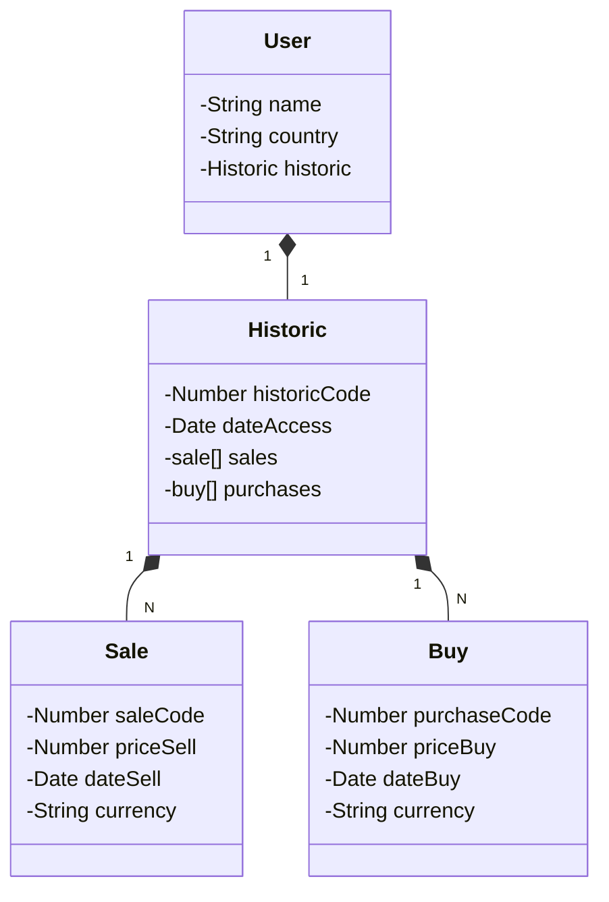

# API-Sell-Buy
## API with objective simulater wallet CryptoCoins using historic buy and Sale.
### Class Diagram

## Public API'S that will be used
### API de Dados v3   
`https://www.mercadobitcoin.com.br/api-doc/`
### Ciprand   
`https://github.com/polarspetroll/ciprand`
